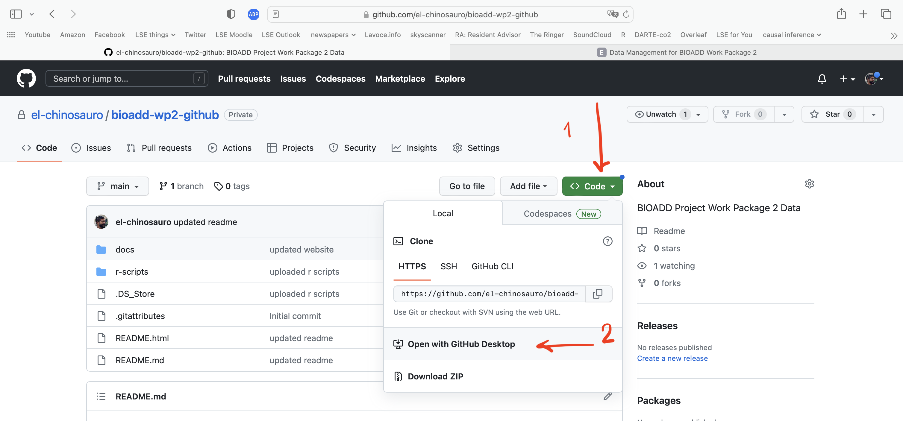
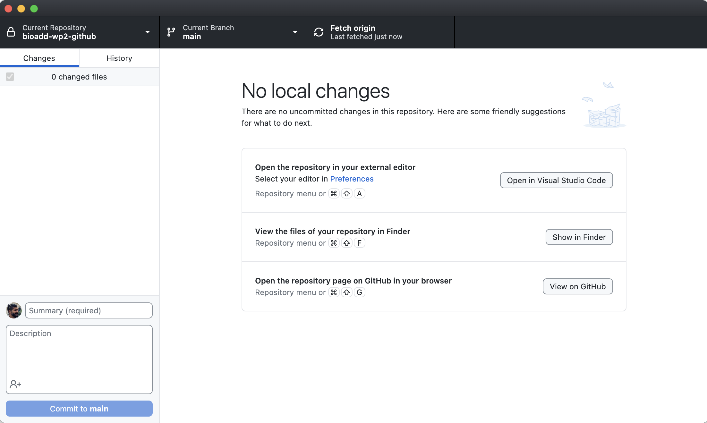
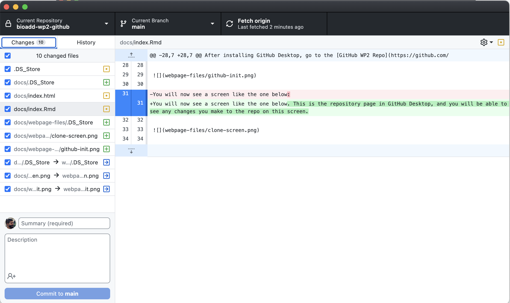
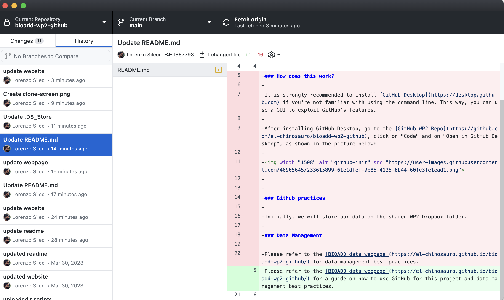

```{r setup, include=FALSE}
knitr::opts_chunk$set(echo = TRUE)
```

### Welcome

This website hosts our **data management protocol** on BIOADD's Work Package 2. It will persist as a static website for the entire duration of the project, so that we can all refer to it when in need of pointers about good data and coding practices with GitHub.

### GitHub Usage

#### Installing and Setup

It is strongly recommended to install [GitHub Desktop](https://desktop.github.com) if you're not familiar with using the command line. This way, you can use a GUI to exploit GitHub's features.

After installing GitHub Desktop, go to the [GitHub WP2 Repo](https://github.com/el-chinosauro/bioadd-wp2-github), click on "Code" and on "Open in GitHub Desktop", as shown in the picture below:



You will now see a screen like the one below. This is the repository page in GitHub Desktop, and you will be able to see any **changes you make to the repo** on this screen.



For example, in the screen below you can see how I have changed this exact file to add a few more lines of text. In red shading you'll see the previous version, and in green the current changes:



You can also access the **repo history**. Below, you can see how 14 minutes prior to writing this, I had edited the repo's README file. From there, I could revert the changes to the state of the art of 14 minutes ago, if I had made some irreparable mistakes.




### Data storage

Initially, we will store all of our **raw and constructed data** on our shared Dropbox folder. It is important to avoid confusion on these folders, as they will be used by all of us at different points in time. For example, in the current `Data` folder on Dropbox, there is a Word document describing the data needs and parameters of interest. Ideally, we would keep such a document in a separate folder named `data-notes` or something of the kind.

##### A quick note on file names

In the interest of mental sanity, let's **avoid using whitespace** in any file names (text, code, folders, etc.). Whitespace kills code and is difficult to detect at a glance. Let's agree on a notation that we can be consistent with going forward. My preferred notation is **small case** with **hyphens** as the word separator, but if we prefer **underscores** there is no problem. 

An example of a bad file name is `data Lorenzo 30_03_2023.dta`. We **won't need any dates in file names** and clearly the combination of small caps, Caps, and underscores would be a mess to use. Moreover, this file would not tell anybody anything on a first glance. Something appropriate could be for example `municipality_nightlights_panel_bolivia.dta`.  

Same thing goes for code scripts and container folders. `code_lorenzo_nightlights.R` would not fly, even if the naming practice is correct; we would need something like `bolivia_municipality_nightlights_extract.R` for this to be recognisable.