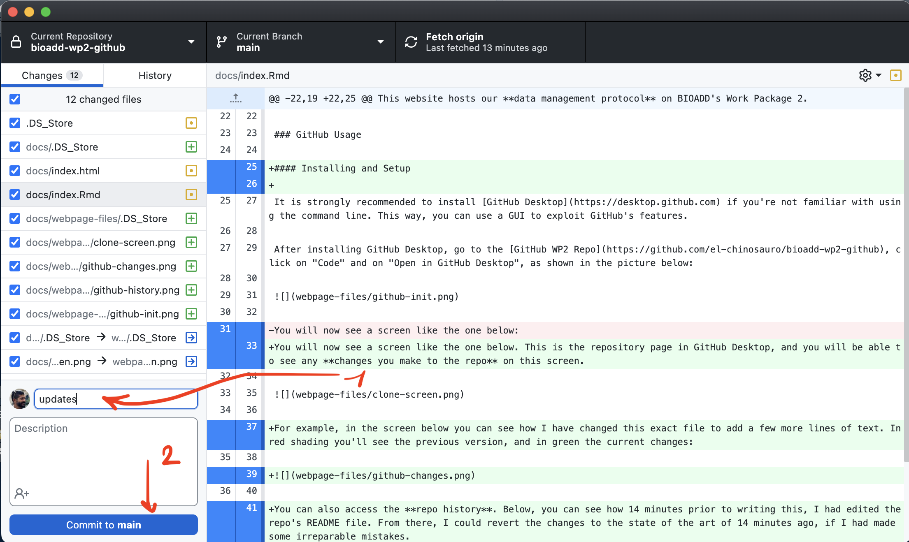

```{r setup, include=FALSE}
knitr::opts_chunk$set(echo = TRUE)
```

### Welcome

This website hosts our **data management protocol** on BIOADD's Work Package 2. It will persist as a static website for the entire duration of the project, so that we can all refer to it when in need of pointers about good data and coding practices with GitHub.

### GitHub Usage

#### Installing and Setup

It is strongly recommended to install [GitHub Desktop](https://desktop.github.com) if you're not familiar with using the command line. This way, you can use a GUI to exploit GitHub's features.

After installing GitHub Desktop, go to the [GitHub WP2 Repo](https://github.com/el-chinosauro/bioadd-wp2-github), click on "Code" and on "Open in GitHub Desktop", as shown in the picture below:


You will now see a screen like the one below. This is the repository page in GitHub Desktop, and you will be able to see any **changes you make to the repo** on this screen.


For example, in the screen below you can see how I have changed this exact file to add a few more lines of text. In red shading you'll see the previous version, and in green the current changes:


You can also access the **repo history**. Below, you can see how 14 minutes prior to writing this, I had edited the repo's README file. From there, I could revert the changes to the state of the art of 14 minutes ago, if I had made some irreparable mistakes.


#### Making changes to the repo

Once you've made the changes you were looking to make, you will see them in the repo screen on GitHub Desktop. In order to sync them from your local machine to the online repo, you need to first **commit** them to a branch of the repo (here I am working on the `main` branch as this is the website for the entire project). Commits need a comment (to be able to retrace them later on):




After clicking on "Commit to `branch_name`", if you're sure about your changes, you can **push** them to the origin. This basically means saving your changes to the online repository. Once commits are pushed, they are merged to the online repository, so they become permanent! To go back to a previous state, you'll need to use the "History" tab and navigate back to the state you desire. Usually, "going back in time" entails opening a new branch of the project (a *problem resolution* branch that can be merged back to main at a later stage.)

We won't go deep into branching at the moment, as for now the project does not have separate papers/datasets, but branching will be useful once we are at that stage. 


#### A simple workflow to illustrate the process

Below, you can see a video of me making some changes in a local R script (producing a simple map of Bolivia), saving it in my machine's drive, committing it to main on GitHub Desktop, and pushing it to origin to sync it with the GitHub folder. This is just a demo to illustrate the workflow. It is fundamental that the R/Stata script you're working on is saved in a subfolder of the `bioadd-wp2-github` folder that you've cloned from GitHub to your local drive.

<video width="720" height="480" controls>
  <source src="webpage-files/demo2.mov" type="video/mp4">
</video>


### Data storage

Initially, we will store all of our **raw and constructed data** on our shared Dropbox folder. It is important to avoid confusion on these folders, as they will be used by all of us at different points in time. For example, in the current `Data` folder on Dropbox, there is a Word document describing the data needs and parameters of interest. Ideally, we would keep such a document in a separate folder named `data-notes` or something of the kind.


##### A quick note on file names

In the interest of mental sanity, let's **avoid using whitespace** in any file names (text, code, folders, etc.). Whitespace kills code and is difficult to detect at a glance. Let's agree on a notation that we can be consistent with going forward. My preferred notation is **small case** with **hyphens** as the word separator (as suggested e.g. by [Google Developers](https://developers.google.com/style/filenames)), but if we prefer **underscores** there is no problem and they might actually work best with some programs. It is ok to use them interchangeably in separate files but let's not mix and match.

An example of a bad file name is `data Lorenzo 30032023.dta`. We **won't need any dates in file names** and clearly the combination of small caps, Caps, and underscores would be a mess to use. Moreover, this file would not tell anybody anything on a first glance. Something appropriate could be for example `municipality_nightlights_panel_bolivia.dta`.  

Same thing goes for code scripts and container folders. `code_lorenzo_nightlights.R` would not fly, even if the naming practice is correct; we would need something like `bolivia_municipality_nightlights_extract.R` for this to be recognisable.

##### Other best practices

I have changed the name of the data folder to `data`.  So far, it has two subfolders, `raw-data`, and `constructed-data`. We should use the first to store any input that we receive from external sources (e.g. SDSN) and that we have not processed yet. Any input that can be downloaded directly onto a R/Stata from within a script should not be saved to the shared Dropbox folder, unless downloading it from the script crashes a local machine or is enormously time consuming.

In the `constructed-data` folder, we should only keep processed intermediate input whose storage is essential (e.g. a dataset of forest cover values created after a very long extraction process in R/GIS/GEE) and with unambiguous names. Let's avoid saving unnecessary files to Dropbox. 

Ideally, we should keep our code **modular** and our outputs **minimal**. It's much better to have 10 scripts which run 100 lines each sequentially (that can be called from a master file) than to have 1 script with 1000 lines (**debugging** would take so much less!). At the same time, it's much better to avoid saving an intermediate output from each of the 10 scripts which serves as an input for the next script (it would be hard to navigate 10 output files in the `constructed-data` folder, especially as we code collaboratively). 

Within scripts, we ought to adhere to three main tenets:

- **Comment each line of code**: this ensures that others can run/debug your code and that you are able to remember what each line does. Moreover, it helps recycling pieces of code in other scripts.

- **Use relative paths**: absolutely avoid hardcoding directories in our code. Create paths to files at the very beginning of a script and use relative paths in the remainder of the script. This way, if a co-author needs to edit/debug your code, they won't need to use the **dangerous** "Find and Replace" tool and they can minimise the time they spend adapting your code to their needs.

- **Comment out anything that is unnecessary to produce outputs but can clog RAM**: for example, an R script which extracts forest cover values onto municipalities may contain a snippet which plots a map of the extracted values, in order to check their consistency. This may run smoothly on your machine but can cause other machines to crash. Unless it is essential to plot that map to understand some elements of that script, comment it out **and mark why you have done so in the comment** (e.g. `# COMMENTED OUT AS RAM INTENSIVE: The two lines below produce a map to check the consistency of the forest cover values extracted to municipalities`).

##### Keep this file current and flag anything that should be added to it!


